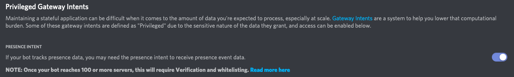

# Dinnerbot - PUBG Win Tracker

> Celebrate and record your PUBG chicken dinners!

[](https://github.com/PTRFRLL/dinnerbot/actions/workflows/main.yml)
[](https://github.com/PTRFRLL/dinnerbot/actions/workflows/node.yml)

[](https://discord.gg)


Dinnerbot is a PUBG Discord companion bot that tracks wins, lists PUBG stats and celebrates your chicken dinners 🥳

- Monitors a channel for winning screenshots and responds with **WINNER WINNER CHICKEN DINNER** and some emoji 🐔 🏆 🍽
- Watches Discord presence to proactively alert user of win and post winning match stats
- Tracks wins for each user
- Queries PUBG API for stats

## Commands

### !wins

Use `!wins` command to see current win count, you can tag users to show their count as well.

Ex. `!wins @DericLee @Tarvis` produces:


### !help

Use `!help` or mention the bot to get a list of available commands


## PUBG Stats

The bot can query the PUBG API for stats from the last win and lifetime stats. You'll need to get a [PUBG API Key](https://developer.pubg.com/) and add it via the `PUBG_API_KEY` [environment variable](#Environment-Variables)


## Winning Screenshots

### Image Comparison

Winning screenshots are determined by comparing the uploaded screenshot with a known win screenshot ([base.png](./data/img/base.png)). If the uploaded screenshot is within a certain similarity score to the base image, a win is awarded.

If the uploaded image is not within the specified threshold, the image will be OCRed and the bot looks for the text **"WINNER WINNER CHICKEN DINNER"**

**Why not OCR first?**

[Take a look at this image](./tests/fail.png)

### Image Hash

When a winning screenshot is added, dinnerbot will compute the SHA1 hash of the uploaded image and store it in the database. This is used to avoid someone uploading duplicate images.


## Presence Detection

dinnerbot can monitor your [Discord Presence](https://discord.com/developers/docs/rich-presence/how-to#so-what-is-it) and detect if you've won a match. If so, it will send a message to your desired channel, along with [stats from the winning match](#PUBG-Stats)


## Getting Started

### Create Bot in Discord Dev portal

Create a new dev app on Discord [here](https://discordapp.com/developers/applications/me).

Under the Bot section, click Add Bot and copy your bot's Token.

**Presence Intent**

If you want dinnerbot to alert when it detects a win via Discord presence, be sure to enable Presence Intent under the Privileged Gateway Intents on the Bot section



Add the bot to your server using [bot authorization flow](https://discordapp.com/developers/docs/topics/oauth2#bots):

Example link (note CLIENT_ID != TOKEN):

```
https://discordapp.com/api/oauth2/authorize?client_id=CLIENT_ID&scope=bot&permissions=75840
```

### Docker

The simplest way to run dinnerbot. You need to map the `/data` volume in order for it to run

```
docker pull ptrfrll/dinnerbot:latest
docker run -d -e BOT_TOKEN="BOT_TOKEN" -e CHANNEL_ID="CHANNEL_ID" -e PUBG_API_KEY="PUBG_API_KEY" -v path_on_local_machine:/data:rw ptrfrll/dinnerbot
```

Example:

```
docker run -d --name dinnerbot \
-e BOT_TOKEN="FAKETOKEN1234" \
-e CHANNEL_ID="1234567890" \
-e PUBG_API_KEY="abc123" \
-v C:\Users\ptrfrll\dinnerbot\data:/data:rw \
ptrfrll/dinnerbot
```

### Run locally

Rename the `example.env` file to `.env` in the root of the project and update the appropriate [environment variables](#Environment-Variables)

Start the bot with:

```
$ npm install
$ npm run dev
```

## Environment Variables

| Name           | Description                                                                       | Required | Default |
| -------------- | --------------------------------------------------------------------------------- | -------- | ------- |
| BOT_TOKEN      | Discord Bot Token                                                                 | ✔        |         |
| CHANNEL_ID     | ID of Discord channel that bot monitors                                           | ✔        |         |
| DATA_PATH      | Path to store DB and log files                                                    | ✔        | `/data` |
| COMMAND_PREFIX | What character to prefix a bot command (e.g. !help)                               |          | !       |
| LOGMODE        | Logging mode (info or debug)                                                      |          | info    |
| AUTH_USERS     | Comma delimited list of Discord user Ids that can preform authorized commands     |          |         |
| AUTH_ROLES     | Comma delimited list of Discord server roles that can preform authorized commands |          |         |
| PUBG_API_KEY   | PUBG API key used for stat lookup                                                 |          |         |

## Built With

- [Discord.js](https://discord.js.org/#/) - Javascript library for Discord API
- [Sequelize](http://docs.sequelizejs.com/) - ORM
- [Axios](https://github.com/axios/axios) - Promise based HTTP client
- [Tesseract.js](https://github.com/naptha/tesseract.js) - OCR Library
- [JIMP](https://github.com/oliver-moran/jimp) - Image processing
