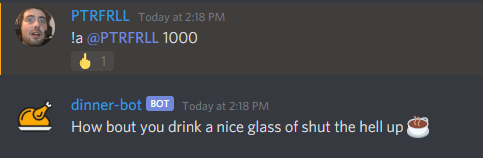

# DinnerBot

[](https://travis-ci.org/PTRFRLL/dinnerbot)
[](https://discord.gg)


Discord bot that listens on a specfic channel for PUBG win screenshots and responds with emoji and WINNER WINNER CHICKEN DINNER if image is within a certain similarity to a base image (this avoids false positives when someone uploads any image). Useful for `chicken-dinner-receipt` channels where only winning screenshots are posted. Keeps track of win count for each tagged users. 

Use `!wins` command to see current win count, you can tag users to show their count as well.

Ex. `!wins @Dirka @tgruenen24` produces: 


## Getting Started

Create a new dev app on Discord [here](https://discordapp.com/developers/applications/me). 

Under the Bot section, click Add Bot and copy your bot's Token.

Edit the config.js file with the channel-id and discord bot token. Be sure to 

Add the bot to your server using [bot authorization flow](https://discordapp.com/developers/docs/topics/oauth2#bots):

Example link (note CLIENT_ID != TOKEN):
```
https://discordapp.com/api/oauth2/authorize?client_id=CLIENT_ID&scope=bot&permissions=75840
```

Start the bot with:

```
$ npm install
$ npm start
```

## Manual Wins  

If an image is uploaded that scores too high but it should be a win, the user marked as `AUTH_USER` in config.js can mention the bot and it will award the win anyway (this only works for the last non-win). Dinner-Bot will respond with a random phrase taken from the `good` array in config.js


If anyone else mentions the bot, it will repond with a response from the `bad` array:



## Configuration

Edit the config.js to change these settings.

```js
IMG_SCORE_THRESHOLD: 15000, //if the image score is below this number it's awared a win (15,000 is arbitrary based off my testing)
LOGMODE: 'prod' //prod or debug
AUTH_USER: 'PTRFRLL', //username that can award wins that scored too high
BOT_RESPONSES_GOOD: good, //array of 'good' responses from bot, replied when AUTH_USER mentions bot
BOT_RESPONSES_BAD: bad //array of 'bad' responses from bot, replied when non-AUTH_USER mentions bot
```


## Built With

* [Discord.js](https://discord.js.org/#/) - Javascript library for Discord API
* [Moment.js](https://momentjs.com/) - Javascript Date Library
* [dotenv](https://github.com/motdotla/dotenv) - Loads environment variables from .env
* [Pixelmatch](https://github.com/mapbox/pixelmatch) - pixel-level image comparison library
* [Sequelize](http://docs.sequelizejs.com/) - ORM
* [Sharp](https://github.com/lovell/sharp) - Image Processing
* [Axios](https://github.com/axios/axios) - Promise based HTTP client