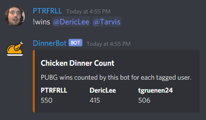

# DinnerBot - PUBG Win Tracker

[](https://github.com/PTRFRLL/dinnerbot/actions/workflows/main.yml)
[](https://github.com/PTRFRLL/dinnerbot/actions/workflows/node.yml)

[](https://discord.gg)


DinnerBot is a Discord bot that listens on a specfic channel for PUBG win screenshots and responds with **WINNER WINNER CHICKEN DINNER** and some emoji 🐔 🏆 🍽 if the image is a winning screenshot. Useful for `chicken-dinner-receipt` channels where only winning screenshots are posted. Keeps track of win count for each tagged users.

### Image Comparison

Winning screenshots are determined by comparing the uploaded screenshot with a known win screenshot ([base.png](./data/img/base.png)). If the uploaded screenshot is within a certain similarity score to the base image, a win is awarded.

If the uploaded image is not within the specified threshold, the image will be OCRed and the bot looks for the text **"WINNER WINNER CHICKEN DINNER"**

### Image Hash

When a winning screenshot is added, dinnerbot will compute the SHA1 hash of the uploaded image and store it in the database. This is used to avoid someone uploading duplicate images.


## Getting Started

### Create Bot in Discord Dev portal

Create a new dev app on Discord [here](https://discordapp.com/developers/applications/me).

Under the Bot section, click Add Bot and copy your bot's Token.

**Presence Intent**

If you want dinnerbot to alert when it detects a win via Discord presence, be sure to enable Presence Intent under the Privileged Gateway Intents on the Bot section


Add the bot to your server using [bot authorization flow](https://discordapp.com/developers/docs/topics/oauth2#bots):

Example link (note CLIENT_ID != TOKEN):

```
https://discordapp.com/api/oauth2/authorize?client_id=CLIENT_ID&scope=bot&permissions=75840
```

### Docker

The simplest way to run dinnerbot. You need to map the `/config` and `/data` volumes in order for it to run

```
docker pull ptrfrll/dinnerbot:latest
docker run -d -e BOT_TOKEN="BOT_TOKEN" -e CHANNEL_ID="CHANNEL_ID" -e PUBG_API_KEY="PUBG_API_KEY" -v path_on_local_machine:/data:rw -v path_on_local_machine:/config:rw ptrfrll/dinnerbot
```

Example:

```
docker run -d --name dinnerbot \
-e BOT_TOKEN="FAKETOKEN1234" \
-e CHANNEL_ID="1234567890" \
-e PUBG_API_KEY="abc123" \
-v C:\Users\ptrfrll\dinnerbot\data:/data:rw \
-v C:\Users\ptrfrll\dinnerbot\config:/config:rw \
ptrfrll/dinnerbot
```

### Run locally

Edit the [config.js](./config.js) file with your discord bot token and the channel-id of the channel you want it to listen on.

Start the bot with:

```
$ npm install
$ npm run dev
```

## Commands

### !wins

Use `!wins` command to see current win count, you can tag users to show their count as well.

Ex. `!wins @DericLee @Tarvis` produces:



### !help

Use `!help` or mention the bot to get a list of available commands


## PUBG Stats

The bot can query the PUBG API for stats from the last win and lifetime stats. You'll need to get a [PUBG API Key](https://developer.pubg.com/) and add it via the `PUBG_API_KEY` environment variable/config file


## Configuration

Edit the [config.js](./config.js) to change these settings.

```js
IMG_SCORE_THRESHOLD: 20000, //if the image score is below this number it's awared a win (20,000 is arbitrary based off my testing)
LOGMODE: 'prod', //prod or debug
AUTH_USERS: {
    //users/roles specified here can award wins that scored too high
    users: [''], //array of user ids
    roles: [''] //array of role names
},
BOT_RESPONSES_GOOD: good, //array of 'good' responses from bot, replied when AUTH_USER mentions bot
BOT_RESPONSES_BAD: bad //array of 'bad' responses from bot, replied when non-AUTH_USER mentions bot
```

## Built With

- [Discord.js](https://discord.js.org/#/) - Javascript library for Discord API
- [Moment.js](https://momentjs.com/) - Javascript Date Library
- [Sequelize](http://docs.sequelizejs.com/) - ORM
- [Axios](https://github.com/axios/axios) - Promise based HTTP client
